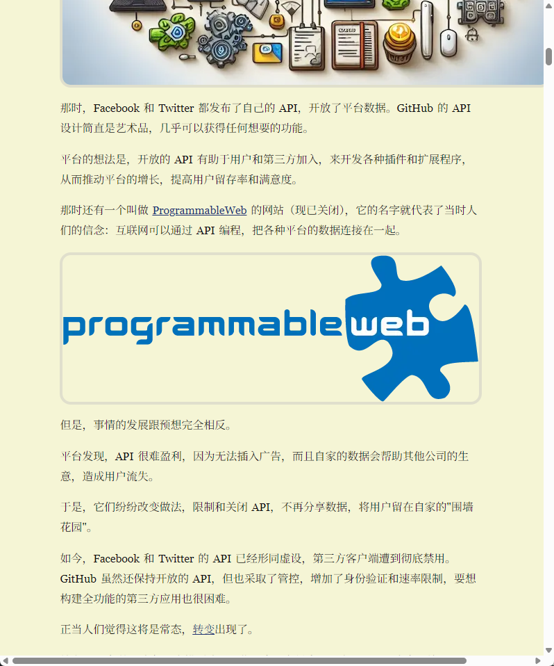
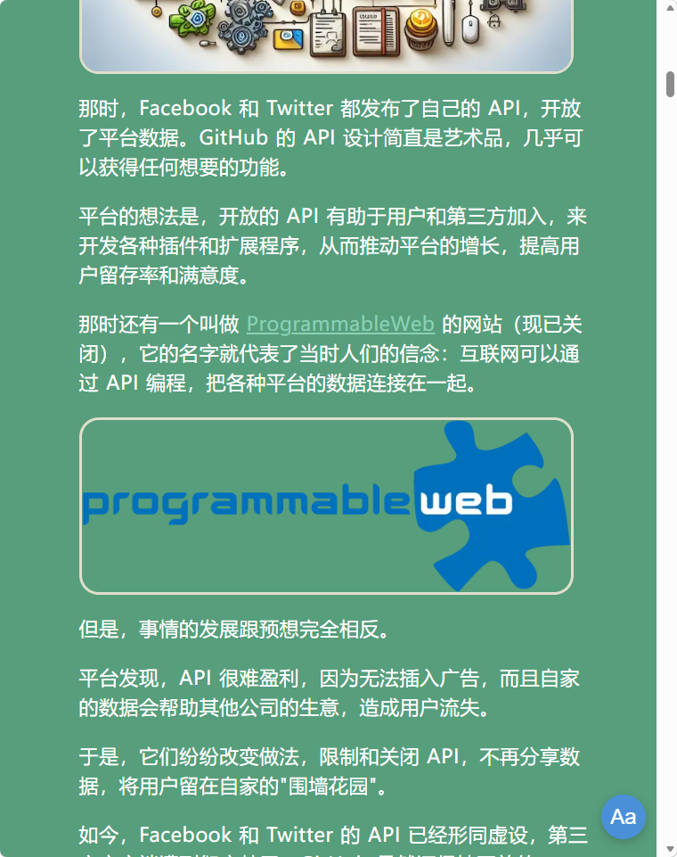

# Web Text Styler

> 专业网页文本样式美化工具，基于专业排版规则，提供多级标题、行宽控制、段间距、统一背景色、护眼墨绿色主题、亮暗模式等功能。

## 效果对比

| 原版 | 插件开启后 |
|------|-------------|
|  |  |

**测试页面**: [阮一峰的网络日志 - 科技爱好者周刊（第 394 期）](https://www.ruanyifeng.com/blog/2026/04/weekly-issue-394.html)

### 对比说明

| 特性 | 原版 | 插件开启后 |
|------|------|-------------|
| 字体大小 | 默认大小 | 22px，舒适阅读 |
| 行高 | 默认 | 1.5倍，呼吸空间充足 |
| 行宽 | 全屏宽度 | 900px，适合1920x1080 |
| 背景色 | 米黄/白色混杂 | 统一墨绿色护眼主题 |
| 标题层级 | 不明显 | 清晰的多级标题比例 |

## 功能特性

### 1. 专业排版规则

基于专业排版规范：
- **正文字体**: 默认 22px，可调节
- **标题层级**: H1(1.9x)、H2(1.5x)、H3(1.25x)、H4(1.15x)
- **行高控制**: 正文的 120%~160%，默认 1.5倍
- **段间距**: 等于行高，默认 1.0em
- **行宽控制**: 支持按字符数（中文推荐 32 字符）或按像素（默认 900px）

### 2. 护眼主题

- **默认主题**: 墨绿色护眼主题（对人眼友好）
- **暗色模式**: 深蓝背景 + 米黄文字，高对比度
- **自定义配色**: 所有颜色均可自定义调整

### 3. 文本高亮

- **高亮模式**: 选中文本或点击文本即可高亮
- **自定义高亮**: 可自定义高亮颜色和透明度
- **一键清除**: 清除所有高亮

### 4. 页面简化

- **隐藏广告**: 自动识别并隐藏广告和无关元素
- **内容优化**: 主要内容区域居中显示

### 5. 便捷控制

- **浮动按钮**: 右下角浮动按钮，快速打开控制面板
- **油猴菜单**: 油猴插件菜单快捷操作
- **配置保存**: 所有设置自动保存
- **跨标签同步**: 配置变更自动同步到其他标签页

## 安装步骤

### 1. 安装油猴插件

如果你还没有安装油猴插件，请先安装：

- **Chrome**: [Tampermonkey](https://chrome.google.com/webstore/detail/tampermonkey/dhdgffkkebhmkfjojejmpbldmpobfkfo)
- **Firefox**: [Tampermonkey](https://addons.mozilla.org/en-US/firefox/addon/tampermonkey/)
- **Edge**: [Tampermonkey](https://microsoftedge.microsoft.com/addons/detail/tampermonkey/iikmkjmpaadaobahmlepeloendndfphd)

### 2. 安装脚本

方法1: 直接打开 `web-text-styler.user.js` 文件，油猴会自动识别并提示安装

方法2: 在油猴插件中选择"添加新脚本"，然后将脚本内容复制粘贴进去

### 3. 启用脚本

安装完成后，确保脚本处于启用状态

## 使用方法

### 打开控制面板

- 点击页面右下角的浮动按钮（显示 "Aa" 图标）
- 或者点击油猴插件图标，选择 "Web Text Styler" -> "打开/关闭控制面板"

### 调整文本样式

1. 打开控制面板
2. 在"文本样式"部分调整滑块：
   - 字体大小：拖动滑块调整文字大小
   - 行高：调整行间距
   - 字间距：调整单个字符之间的距离
   - 词间距：调整单词之间的距离
3. 调整后会立即应用到页面上

### 使用高亮功能

1. 打开控制面板
2. 在"高亮设置"部分：
   - 可先设置高亮颜色和透明度
   - 点击"进入高亮模式"按钮
3. 进入高亮模式后：
   - 页面顶部会显示"高亮模式：点击文本进行高亮"提示
   - 选中任意文本，会自动高亮
   - 点击任意文本元素，会高亮整个元素
4. 点击"退出高亮模式"按钮退出
5. 点击"清除所有高亮"按钮移除所有高亮

### 切换亮暗模式

1. 打开控制面板
2. 在"显示模式"部分：
   - 勾选"暗色模式"即可切换到暗色主题
   - 取消勾选则回到亮色主题
3. 可自定义亮色/暗色模式的文字颜色和背景颜色

### 简化页面

1. 打开控制面板
2. 在"页面简化"部分：
   - 勾选"简化页面（隐藏广告和无关元素）"
   - 插件会自动隐藏广告、弹窗、侧边栏等无关元素
   - 主要内容区域会居中显示

### 恢复默认设置

1. 打开控制面板
2. 点击"恢复默认设置"按钮
3. 所有设置将恢复到初始状态

## 默认配置

### 正常模式（墨绿色护眼主题）

| 配置项 | 默认值 | 说明 |
|--------|--------|------|
| 正文字体 | 22px | 可调节 |
| 行高 | 1.5 | 正文的 150% |
| 行宽模式 | pixels | 按像素 |
| 默认行宽 | 900px | 适配 1920x1080 |
| 主背景色 | `#264d39` | 深墨绿色 |
| 内容区背景 | `#2a5540` | 稍亮的墨绿 |
| 文字颜色 | `#e8e8e8` | 浅灰 |
| 链接颜色 | `#8ad0b5` | 浅绿 |

### 暗色模式

| 配置项 | 默认值 | 说明 |
|--------|--------|------|
| 主背景色 | `#1a1a2e` | 深蓝 |
| 内容区背景 | `#16213e` | 稍亮的深蓝 |
| 文字颜色 | `#f5f5dc` | 米黄（高对比度） |
| 链接颜色 | `#87ceeb` | 天蓝 |

### 标题层级

| 标题 | 比例 | 字号（22px 正文） |
|------|------|-------------------|
| H1 | 1.9x | ~42px |
| H2 | 1.5x | ~33px |
| H3 | 1.25x | ~28px |
| H4 | 1.15x | ~25px |
| 小字体 | 0.75x | ~17px |

## 兼容性

- **浏览器**: Chrome、Firefox、Edge、Safari 等主流浏览器
- **油猴插件**: Tampermonkey、Greasemonkey、Violentmonkey 等
- **网站**: 适配所有网站 (`*://*/*`)

## 技术特性

- **全局适配**: 适配所有网站
- **智能排除**: 插件自身的 UI 元素不会被样式修改影响
- **实时预览**: 所有设置调整实时生效，无需刷新页面
- **配置持久化**: 使用 `GM_getValue`/`GM_setValue` 存储配置
- **跨标签同步**: 使用 `GM_addValueChangeListener` 实现配置同步
- **内联样式覆盖**: 使用 JavaScript 直接覆盖页面内联样式

## 项目信息

- **作者**: liuzhx
- **创建时间**: 2026-04-26
- **项目地址**: [https://github.com/MiniMilkfish/SoloCoder04/tree/main/001-WebTextStyler](https://github.com/MiniMilkfish/SoloCoder04/tree/main/001-WebTextStyler)
- **版本**: 2.1.0

## 免责声明

> **重要提示：使用本插件即表示您同意以下条款**

### 1. 使用风险

本插件仅供学习和个人使用目的而提供。作者不对使用本插件造成的任何直接或间接损失负责。

### 2. 网站兼容性

本插件尝试在所有网站上工作，但由于网站结构和样式的多样性，可能在某些网站上出现：
- 样式冲突
- 布局错乱
- 功能异常

如遇问题，请暂时禁用本插件。

### 3. 数据隐私

本插件：
- **不会**收集任何个人数据
- **不会**上传任何浏览记录
- **不会**追踪用户行为
- 所有配置仅保存在用户本地浏览器中

### 4. 免责范围

在法律允许的最大范围内，作者不对以下情况负责：
- 任何直接、间接、偶然、特殊或惩罚性损害
- 因使用或无法使用本插件造成的损失
- 第三方网站的内容或行为

### 5. 修改权

作者保留随时修改本插件和本免责声明的权利，无需提前通知。

### 6. 适用法律

本免责声明受中华人民共和国法律管辖。

---

**如果您不同意以上条款，请不要安装或使用本插件。**

## 许可证

MIT License

## 贡献

欢迎提交 Issue 和 Pull Request。

## 更新日志

### v2.1.0 (2026-04-26)
- 修复控制面板文本颜色被页面样式覆盖的问题
- 新增安全的 JavaScript 函数覆盖内联背景色
- 修复暗色模式文本对比度问题，使用米黄色作为兜底配色
- 更新脚本元数据，添加作者、项目地址、创建时间

### v2.0.0 (2026-04-26)
- 基于专业排版规则重构
- 新增多级标题层级控制
- 新增行宽控制（按字符数/像素）
- 新增段落间距设置
- 新增统一背景色功能
- 新增护眼墨绿色主题
- 新增亮暗模式切换
- 适配 Windows 1920x1080 分辨率

### v1.0.0 (2026-04-26)
- 初始版本发布
- 基础文本样式调整（字体大小、行高、字间距）
- 文本高亮功能
- 暗色模式
- 页面简化功能
